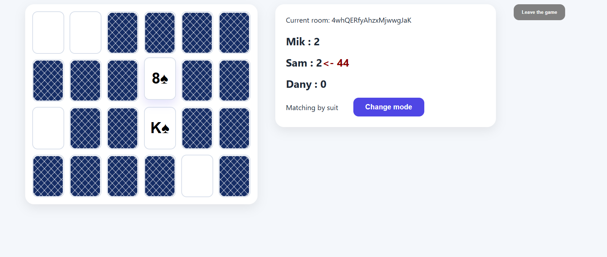

# Multiplayer Memory Card Game

A real-time multiplayer memory card game where players take turns finding matching pairs of cards. Remember the card positions, score the most points, and beat your opponents before the board is cleared.

## Features

- 🎮 Supports **1–8 players**
- ⏱️ Turn timer with automatic turn switching
- 🃏 Multiple matching game modes
- 🔥 Real-time multiplayer powered by Firebase
- 🏆 Automatic score tracking and winner detection

## Technologies

- React
- TypeScript
- Firebase Realtime Database
- Cloud Firestore

## How to Play

1. Create a new game room or join an existing one.
2. When your timer is **red**, it is your turn.
3. Flip two cards on the board.
4. If the cards match:
  - They are removed from the board.
  - You earn points.
  - You continue your turn.
5. If the cards do not match:
  - They are flipped face down again.
  - Your turn passes to the next player.
6. If your turn timer expires before you make a move, your turn is automatically passed to the next player.
7. The game ends when no matching pairs remain. The player with the highest score wins.

## Screenshot



## Game Modes

- Match cards by **Suit**
- Match cards by **Value**

## Getting Started

### Prerequisites

- Node.js
- npm
- A Firebase project with:
  - Realtime Database
  - Cloud Firestore

### Installation

1. Clone the repository.

   ```bash
   git clone <repository-url>
   cd <project-folder>
   ```

2. Install dependencies.

   ```bash
   npm install
   ```

3. Create a Firebase project.

4. Enable:
  - Realtime Database
  - Cloud Firestore

5. Configure your Firebase credentials in:

   ```text
   src/config/firebase.ts
   ```

6. Start the development server.

   ```bash
   npm start
   ```

## Deployment

Deploy the application to Firebase Hosting:

```bash
firebase deploy
```